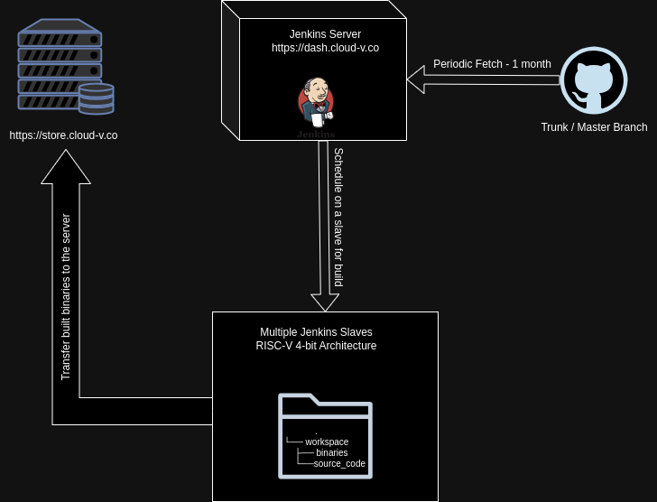

# Cloud-V Builds
This repository contains the CI pipelines which are used for periodically (intervals may change with time) building open-source software tools and libraries for RISC-V.

**All the RISC-V compiled binaries are available at: https://store.cloud-v.co/index.php/s/GWxkHQ8xb5EpjLX**  
**The CI builds are public at: https://dash.cloud-v.co/job/cloud-v-builds-folder/**

The infrastructure of the builds can be seen in the following diagram:

## Contributing

If you find a program that you think should be added for the regular builds, you can create an issue with its name, repository link, etc.
